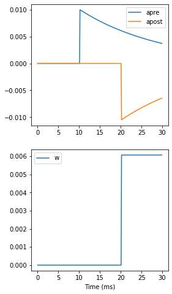

# 5-Brian2-3.md

## STDP

### STDP 란?

- Spike-Timing-Dependent Plasticity
- 스파이크 발생 전(전위) 또는 스파이크 발생 후(후위) 시냅스 강도의 변화하는 학습 원리를 설명하는 모델
  - 이후 모든 내용에 스파이크 발생 전은 **전위**, 스파이크 발생 후는 **후위** 라는 표현으로 사용하겠습니다.
- 두 개의 신경 세포가 동시에 활성화되면 시냅스 강도 증가, 두 개의 신경 세포가 시간적인 차이를 가지고 활성화되면 시냅스 강도가 감소


### STDP의 방정식

$$W(\Delta t) = \begin{cases}
A_{pre} e^{-\Delta t/\tau_{pre}} & \Delta t>0 \\
A_{post} e^{\Delta t/\tau_{post}} & \Delta t<0
\end{cases}$$

- 위의 수식을 파이썬으로 변경하면 다음 아래와 같다.

```python
where(delta_t>0, A_pre*exp(-delta_t/tau_pre), A_post*exp(delta_t/tau_post))
```

- where(A, B, C) : A 조건이 참이면 B를 출력, 거짓이면 C를 출력하는 메소드

### 그래프로 보기

```python
tau_pre = tau_post = 20*ms
A_pre = 0.01
A_post = -A_pre*1.05
delta_t = linspace(-50, 50, 100)*ms
W = where(delta_t>0, A_pre*exp(-delta_t/tau_pre), A_post*exp(delta_t/tau_post))
```


|변수명|설명|
|---|---|
|tau_pre|전위의 시간 상수 값|
|tau_post|후위의 시간 상수 값|
|A_pre|전위의 가중치 상수 값|
|A_post|후의의 가중치 상수 값|
|delta_t|-50 ~ 50을 100으로 나눈 시간 리스트|
|W|막전위의 가중치 값|

### apre와 apost 그래프

```python
taupre = taupost = 20*ms
wmax = 0.01
Apre = 0.01
Apost = -Apre*taupre/taupost*1.05

G = NeuronGroup(2, 'v:1', threshold='t>(1+i)*10*ms', refractory=100*ms)

S = Synapses(G, G,
            '''
            w : 1
            dapre/dt = -apre/taupre : 1 (clock-driven)
            dapost/dt = -apost/taupost : 1 (clock-driven)
            ''',
            on_pre='''
            v_post += w
            apre += Apre
            w = clip(w+apost, 0, wmax)
            ''',
            on_post='''
            apost += Apost
            w = clip(w+apre, 0, wmax)
            ''', method='linear')
S.connect(i=0, j=1)
M = StateMonitor(S, ['w', 'apre', 'apost'], record=True)

run(30*ms)
```



|변수명|설명|
|---|---|
|taupre|전위 시간 상수|
|taupost|후위 시간 상수|
|wmax|시냅스 가중치의 최대값|
|Apre|전위 가중치 변화량|
|Apost|후위 가중치 변화량|
|on_pre|전위 가중치 계산|
|on_post|후위 가중치 계산|

- (event-driven) 옵션: 변수가 지속적으로 변화하더라도 스파이크 발생시에만 값 업데이트
- clip: 지정한 범위를 벗어나지 않도록 변수 값 제어
